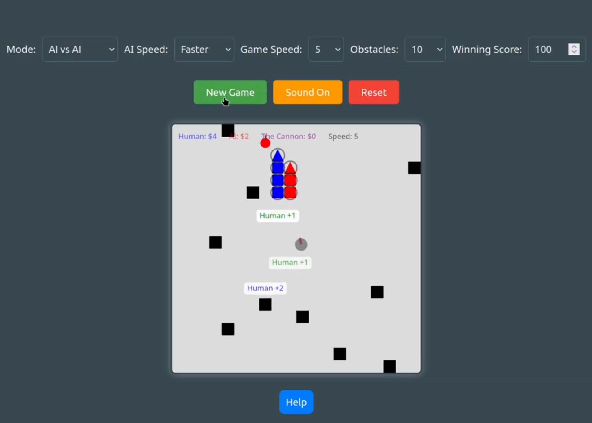

# Snake Game with Two Snakes and Extra Features

## Overview
This is a modern take on the classic Snake game, built using [p5.js](https://p5js.org/). The game features two snakes (one player-controlled and one AI-controlled or both AI-controlled), dynamic obstacles, a central cannon, various food types, and power-ups. It supports both desktop (keyboard controls) and mobile (on-screen buttons) gameplay, with customizable settings and sound effects. The game is designed to be engaging with strategic elements, such as score penalties for collisions, temporary boosts from power-ups, and a cannon that interacts with the snakes.

[Play the Snake Game with Two Snakes](https://pazoff.github.io/Snake-Game-with-Two-Snakes/)  
👉 Tip: Right-click the link and choose "Open link in new tab", or hold **Ctrl** (Windows/Linux) or **Cmd** (Mac) while clicking to open in a new tab.

👉 **Watch the Demo**

[](https://youtu.be/7qOhsr7XG3Y)

## Google Gemini 2.5 Pro Model Review Of The Game

> Okay, based on the detailed analysis:

> **Functionality & Feature Completeness:** Very high. Implements a wide range of complex features beyond a basic Snake game.

> **Code Quality & Structure:** High. Good use of classes, generally readable, well-commented. Minor points on magic numbers and globals.

> **UI/UX & Customization:** High. Good feedback, mobile support, settings persistence.

> **Robustness:** Good. Handles collisions, invincibility frames, attempts safe obstacle placement.

> **Overall Complexity & Effort:** Clearly significant effort went into this feature-rich version.

> Considering all these aspects, I would give this project a score of:

> **9 / 10**

> It's a highly impressive and well-executed implementation with a vast feature set. The minor areas for potential refinement don't significantly detract from the overall quality and functionality. It's a strong piece of work.

## How to Play
- **Objective**: Eat food to grow your snake and earn points. The first snake to reach the **winning score** (default: 1000 points) wins.
- **Snakes**:
  - **Player Snake (Human)**: Blue, controlled via arrow keys (desktop) or on-screen buttons (mobile).
  - **AI Snake (AI)**: Red, moves automatically to chase food or power-ups.
- **Game Modes**:
  - **Player vs AI**: You control Human against the AI-controlled AI snake.
  - **AI vs AI**: Watch Human and AI, both AI-controlled, compete.
- **Controls**:
  - **Desktop**: Use arrow keys (↑, ↓, ←, →) to move Human.
  - **Mobile**: Use on-screen buttons (↑, ↓, ←, →) displayed in Player vs AI mode.
- **Starting the Game**:
  - Select a game mode, AI speed, game speed, number of obstacles, and winning score via the controls at the top.
  - Click **New Game** to start.
  - Use **Restart Game** to reset with current settings or **Reset** to reload the page (saves settings).
- **Sound**: Toggle sound on/off with the **Sound On/Muted** button. Sound settings persist across sessions.

## Features
### Core Gameplay
- **Grid-Based Movement**: The game is played on a 20x20 grid, with each tile representing a potential position for snakes, food, obstacles, or the cannon.
- **Wrapping**: Snakes wrap around the screen edges (e.g., moving off the right edge reappears on the left).
- **Scoring**:
  - **Regular Food**: Red apple, grants +1 point and grows the snake by one segment. Plays "eat" sound.
  - **Super Food**: Golden, pulsing item, grants +5 points, grows the snake, and slows game speed by 2 units. Disappears after 5 seconds. Plays "ding" sound.
  - **Shrink Food**: Pink item, grants +2 points, shrinks the snake to 3 segments, and slows game speed by 1 unit. Disappears after 8 seconds. Plays "ding" and "shrink" sounds if shrunk.
  - **Mystery Food**: White square with "?", randomly grants either:
    - **Super Effect**: +5 points, growth, slows game speed by 2 units. Plays "ding" sound.
    - **Shrink Effect**: +2 points, shrinks to 3 segments, slows game speed by 1 unit. Plays "ding" and "shrink" sounds if shrunk.
    - Disappears after 8 seconds.
- **Collisions**: Hitting obstacles, yourself, or the other snake results in score penalties, a 30-frame invincibility period, and specific sounds:
  - **Self-Collision**: Lose half your score (rounded down), other snake gains it. Plays "hit" sound.
  - **Snake Collision**: Lose all your score, other snake gains it. Plays "hit" sound.
  - **Obstacle Collision**: Lose 80% of your score (rounded down), other snake gains it. Plays "hit" sound.

### Advanced Features
- **Obstacles**: Black blocks (5–100, configurable) that move every 30 seconds. Colliding with them incurs a score penalty.
- **Cannon**: A moving cannon ("The Cannon") chases the closest snake, with its barrel facing its movement direction. It shoots projectiles every 30 frames. If hit, the snake grows by 1 segment, loses 1 point (if score > 0), and the cannon gains 1 point. The cannon’s score is displayed as "The Cannon: $X". Plays no sound on hit.
- **Power-Ups**: Temporary boosts that spawn randomly and disappear after 8 seconds. Plays "ding" sound with a pop-up message:
  - **Speed Boost**: Yellow lightning bolt, increases speed by 50% for ~100 frames (5 seconds at 20 FPS). Shows "Speed Up!"
  - **Invincibility**: Blue shield, prevents collisions for ~100 frames (5 seconds at 20 FPS). Shows "Invincible!"
  - **Score Multiplier**: Purple star, doubles points from food for ~200 frames (10 seconds at 20 FPS). Shows "x2 Points!"
- **Dynamic Game Speed**:
  - Base speed is set via the **Game Speed** selector (1–40).
  - Speed increases by 1 unit for every 150 points (combined score of both snakes), capped at 40.
  - Super and Shrink foods reduce speed temporarily.
- **Visual Feedback**:
  - Point pop-ups display score changes or events (e.g., "+5", "Human Crashed!"), limited to the last 10 for performance.
  - Invincibility is indicated by a black outline around snake segments.
  - The cannon glows red when about to fire (within 15 frames).
- **Settings Persistence**: Game mode, AI speed, game speed, number of obstacles, winning score, and sound settings are saved to `localStorage` and persist across page reloads.

### UI Elements
- **Controls Table**:
  - **Mode**: Select Player vs AI or AI vs AI.
  - **AI Speed**: Adjust AI snake's update interval (0–6, lower is faster: Faster, Fast, Normal, Slower, Slowest, Stoned, Zombi).
  - **Game Speed**: Set base frame rate (1–40).
  - **Obstacles**: Choose number of obstacles (5–100, in increments of 5).
  - **Winning Score**: Set the score needed to win (default: 1000, minimum 1).
- **Buttons**:
  - **New Game**: Start a game with current settings.
  - **Restart Game**: Reset the game with current settings.
  - **Reset**: Reload the page, saving settings (useful for fixing lag).
  - **Sound On/Muted**: Toggle sound effects.
  - **Help**: Show/hide the rules section.
- **Mobile Controls**: On-screen buttons for ↑, ↓, ←, → appear in Player vs AI mode on mobile devices.

## Function Descriptions
Below is a detailed description of the key functions in the game, grouped by category. These functions are defined in the main `<script>` section of `snakes.html`.

### Game Setup and Initialization
- **`preload()`**:
  - Loads sound files (`eat.mp3`, `hit.mp3`, `ding.mp3`, `shrink.mp3`, `gameover.mp3`, `finale.mp3`) for use in the game.
  - Supports `.mp3` and `.wav` formats via `soundFormats('mp3', 'wav')`.
- **`setup()`**:
  - Initializes the game canvas (size based on 90% of window dimensions, max 400x400, aligned to 20x20 grid).
  - Sets the default frame rate (`defaultRate`, default 2).
  - Retrieves DOM elements (e.g., `startButton`, `modeSelect`) for interaction.
  - Calls `initializeGame()` to set up game objects.
- **`initializeGame()`**:
  - Creates game objects: `playerSnake` (at 5,5), `aiSnake` (at 15,15), `food`, `superFood`, `shrinkFood`, `mysteryFood`, `powerUp`, `obstacles`, `cannon`.
  - Generates initial obstacles based on `numObstacles` (default 15).
  - Resets `speedDecrease`, `pointPopups`, and `isAnySoundPlaying`.
  - Calls `loadSettings()` to restore saved settings.
- **`WinScoreInput.addEventListener('change', ...)`**:
  - Saves settings when the winning score input changes.

### Game Loop
- **`draw()`**:
  - Main game loop, runs every frame.
  - Updates the dynamic frame rate: `min(defaultRate + floor((playerSnake.score + aiSnake.score) / 150) + speedDecrease, 40)`.
  - If the game is started and not over:
    - Shows and updates food, obstacles, special foods, power-ups, and the cannon.
    - Updates `playerSnake` (player-controlled in Player vs AI, AI-controlled in AI vs AI) and `aiSnake` (every `aiUpdateInterval` frames).
    - Checks for collisions and cannon hits.
    - Shows mobile controls in Player vs AI mode on mobile devices.
  - If game over, displays the game over message and shows the reset button.
  - If not started, prompts to select a mode and start the game.
  - Displays scores (Human, AI, Cannon) and current speed in the top-left corner.
  - Spawns new `shrinkFood` (0.4% chance), `mysteryFood` (0.3% chance), or `powerUp` (0.3% chance) if inactive.
  - Updates and shows point pop-ups, removing expired ones.
- **`checkCannonHits()`**:
  - Checks if cannon projectiles hit a snake’s segments.
  - If hit and not invincible, grows the snake by 1 segment, deducts 1 point from the snake (if > 0), adds 1 point to the cannon, and shows a pop-up (e.g., "Human -1, Cannon +1").

### Input Handling
- **`keyPressed()`**:
  - Handles arrow key inputs for the player snake in Player vs AI mode when the game is started and not over.
  - Calls `setDirectionFromKey(keyCode)` to update `playerSnake.dir`.
- **`setDirectionFromKey(keyCode)`**:
  - Maps arrow keys to direction vectors (e.g., `UP_ARROW` → `[0, -1]`).
  - Prevents reversing direction (e.g., can't move up if going down).
- **`setDirection(dx, dy)`**:
  - Sets the player snake’s direction based on mobile button inputs (`ontouchstart` events).
  - Prevents reversing direction, only active in Player vs AI mode when the game is started and not over.

### Game State Management
- **`startGame()`**:
  - Initializes a new game with current settings (mode, win score, obstacles, AI speed, game speed).
  - Saves settings, starts audio via `userStartAudio()`, sets `gameStarted` to `true`, and calls `initializeGame()`.
  - Hides the restart button.
- **`restartGame()`**:
  - Resets the game with current settings, similar to `startGame()`.
  - Hides the restart button.
- **`resetGame()`**:
  - Prompts for confirmation, saves settings, and reloads the page to fix lag or reset the game state.
- **`saveSettings()`**:
  - Saves game settings (`gameMode`, `aiSpeed`, `gameSpeed`, `numObstacles`, `winScore`, `soundEnabled`) to `localStorage` as JSON.
- **`loadSettings()`**:
  - Loads settings from `localStorage`, applying defaults if not present (`gameMode`: "playerVsAI", `aiSpeed`: "2", `gameSpeed`: "2", `numObstacles`: "15", `winScore`: "1000", `soundEnabled`: true).
  - Updates game state via `updateGameMode()`, `updateAISpeed()`, `updateGameSpeed()`, `updateObstacles()`, and sets `muteButton` text.
- **`toggleSound()`**:
  - Toggles `soundEnabled`, updates `muteButton` text ("Sound On" or "Muted"), and saves settings.
- **`playSoundIfNotPlaying(sound)`**:
  - Plays a sound if `soundEnabled` is `true` and the sound isn’t already playing (uses `sound.isPlaying()`).

### Game Logic
- **`checkCollisions()`**:
  - Checks if either snake reaches `winScore`, ending the game with a winner (e.g., "Human Wins!").
  - For each snake, if not invincible:
    - **Self-Collision**: Halves score (rounded down), gives it to the other snake, sets 30-frame invincibility, shows pop-up (e.g., "Human Crashed into itself!").
    - **Snake Collision**: Loses all score to the other snake, sets 30-frame invincibility, shows pop-up (e.g., "Human Crashed into AI!").
    - **Obstacle Collision**: Loses 80% of score (rounded down) to the other snake, sets 30-frame invincibility, shows pop-up (e.g., "Human Crashed into Obstacle!").
- **`clearPointPopupsKeepRecent()`**:
  - Limits point pop-ups to the last 10 to prevent performance issues.

### Settings Updates
- **`updateGameMode()`**:
  - Sets `gameMode` based on `modeSelect.value` ("playerVsAI" or "AIVsAI"), removes focus, and saves settings.
- **`updateAISpeed()`**:
  - Sets `aiUpdateInterval` based on `AIspeedSelect.value` (0–6), removes focus, and saves settings.
- **`updateGameSpeed()`**:
  - Sets `defaultRate` based on `GameSpeedSelect.value` (1–40), updates frame rate, removes focus, and saves settings.
- **`updateObstacles()`**:
  - Sets `numObstacles` based on `NumberOfObstaclesSelect.value` (5–100), regenerates obstacles, removes focus, and saves settings.

### Classes
- **`Snake`**:
  - **Constructor**: Initializes position (`x`, `y`), direction (`dir`), color, score (0), name, and power-up states (`speedBoost`, `speedTimer`, `invincibilityTimer`, `scoreMultiplier`, `multiplierTimer`).
  - **`update()`**: Moves the snake by `dir * speedBoost`, wraps around edges, checks for collisions with food/power-ups, applies effects (e.g., +5 points for super food), and pops tail if no food is eaten. Adjusts distance threshold for food collision based on `speedBoost`.
  - **`updateAI()`**: AI logic to chase targets (power-up > mystery food > shrink food > super food > regular food), selects valid directions, and calls `update()`.
  - **`getValidDirections(head)`**: Returns valid movement directions that avoid collisions.
  - **`isValidMove(dir)`**: Checks if a direction avoids collisions with self, other snake, obstacles, cannon, or projectiles (unless invincible).
  - **`show()`**: Draws the snake with a triangular head (rotated by `dirToAngle`) and square body segments. Adds a black outline if invincible.
  - **`dirToAngle(dir)`**: Converts direction to rotation angle (e.g., `[1, 0]` → `HALF_PI` for right).
- **`Cannon`**:
  - **Constructor**: Places cannon at grid center (10,10), initializes empty `projectiles`, `shootInterval` (30 frames), `frameCounter`, `lastAngle`, `moveAngle`, `isFiringSoon`, `speed` (0.1), and `score` (0).
  - **`update()`**: Moves toward the closest snake at `speed`, updates `moveAngle`, fires every `shootInterval` frames via `aimAndShoot()`, removes off-screen projectiles, and limits to 5 projectiles.
  - **`show()`**: Draws the cannon as a gray circle with a rotating barrel (red when `isFiringSoon`), and projectiles as black circles.
  - **`aimAndShoot()`**: Targets the closest snake, calculates direction, and adds a projectile with normalized velocity.
- **`Food`**:
  - **Constructor**: Spawns at a random grid position.
  - **`show()`**: Draws a red apple (ellipse) with a brown stem (line).
- **`SuperFood`**:
  - **Constructor**: Initializes as inactive with `duration` (300 frames), `timer`, `x`, `y`, and `pulseTime`.
  - **`maybeSpawn()`**: Spawns with 0.5% chance if inactive.
  - **`update()`**: Decrements `timer`, deactivates if `timer` ≤ 0, attempts to spawn if inactive, and updates `pulseTime` for animation.
  - **`show()`**: Draws a pulsing golden circle if active.
- **`ShrinkFood`**:
  - **Constructor**: Spawns randomly with `lifetime` (8000 ms), sets `timer` to current `millis()`, and sets `active` to `true`.
  - **`spawn()`**: Picks a new random position.
  - **`update()`**: Deactivates if `millis() - timer > lifetime`.
  - **`show()`**: Draws a pink circle with a darker outline if active.
- **`MysteryFood`**:
  - **Constructor**: Spawns randomly with `duration` (8000 ms), sets `spawnTime` to current `millis()`, and sets `active` to `true`.
  - **`update()`**: Deactivates if `millis() - spawnTime > duration`.
  - **`show()`**: Draws a white square with a purple "?" if active.
- **`PowerUp`**:
  - **Constructor**: Picks a random type (`speed`, `invincibility`, `multiplier`), spawns randomly, sets `duration` (8000 ms), `spawnTime`, `active` to `true`, and `pulseTime`.
  - **`update()`**: Deactivates if `millis() - spawnTime > duration`, updates `pulseTime` for animation.
  - **`show()`**: Draws type-specific shapes if active: yellow triangle for speed, blue circle for invincibility, purple star for multiplier.
  - **`applyEffect(snake)`**: Applies the power-up effect: speed (`speedBoost = 1.5`, `speedTimer = 100`), invincibility (`invincibilityTimer = 100`), or multiplier (`scoreMultiplier = 2`, `multiplierTimer = 200`). Shows a pop-up (e.g., "Human Speed Up!").
- **`Obstacles`**:
  - **Constructor**: Initializes an empty `positions` list and `lastMoved` (0).
  - **`generate(numObstacles)`**: Spawns `numObstacles` obstacles, avoiding snakes, food, power-ups, and cannon. Limits attempts to prevent infinite loops.
  - **`move()`**: Regenerates obstacles every `moveObstaclesAfter` (30000 ms) based on `millis()`.
  - **`show()`**: Draws black squares for each obstacle.
- **`PointPopup`**:
  - **Constructor**: Initializes position (`x`, `y`), `text`, `color`, `opacity` (250), and `lifetime` (20 frames).
  - **`update()`**: Moves upward (-0.4 pixels), reduces `opacity` (-4.5), decrements `lifetime`.
  - **`show()`**: Draws a white rectangle with rounded corners and colored text.
  - **`isDone()`**: Returns `true` if `lifetime` ≤ 0.

### Utility Functions
- **`isMobileDevice()`**:
  - Detects mobile devices via `navigator.userAgent` regex (`/Mobi|Android|iPhone|iPad|iPod/i`) to show on-screen controls.
- **`clamp(min, val, max)`**:
  - Limits a value between `min` and `max` for text sizing (e.g., `textSize(clamp(12, 3 * tileSize, 16))`).
- **`toggleRules()`**:
  - Toggles the visibility of the rules section (`display: none` or `block`).

## Technical Details
- **Framework**: Built with p5.js (v1.4.2) and p5.sound for audio.
- **Canvas**: Dynamically sized (90% of window width/height, max 400px, aligned to 20x20 grid).
- **Storage**: Uses `localStorage` to save settings as JSON.
- **Sound**: Supports multiple sound effects (`eat`, `hit`, `ding`, `shrink`, `gameover`, `finale`), toggled via `soundEnabled`.
- **Responsive Design**: Adapts to desktop and mobile with CSS media queries (e.g., grid layout for mobile controls at `max-width: 600px`) and touch-friendly buttons (`touch-action: manipulation`).
- **Dependencies**:
  - `p5.min.js`: Core p5.js library (CDN: Cloudflare).
  - `p5.sound.min.js`: For sound effects (CDN: Cloudflare).
- **Open Graph Meta Tags**: Included for social sharing (title, description, image, URL, type).

## Setup Instructions
1. **Clone the Repository**:
   ```bash
   git clone https://github.com/pazoff/Snake-Game-with-Two-Snakes
   ```
2. **Host the Game**:
   - Use a local server (e.g., `python -m http.server` or VS Code Live Server) to serve `snakes.html`.
   - Ensure the `sounds/` folder with `.mp3` files (`eat.mp3`, `hit.mp3`, `ding.mp3`, `shrink.mp3`, `gameover.mp3`, `finale.mp3`) is in the same directory.
3. **Open in Browser**:
   - Navigate to `http://localhost:<port>/snakes.html`.
   - The game runs in any modern browser (Chrome, Firefox, Safari).

## Troubleshooting
- **No Sound**: Ensure sound files are in the `sounds/` folder, `soundEnabled` is `true`, and browser audio permissions are granted. Check console for loading errors.
- **Lag**: Click **Reset** to reload the page, which clears memory and preserves settings via `localStorage`.
- **Mobile Controls Not Showing**: Verify `isMobileDevice()` detects your device (test `navigator.userAgent`); ensure Player vs AI mode is selected.
- **Settings Not Saving**: Check if `localStorage` is enabled in your browser (e.g., not in private mode).
- **Obstacles Not Spawning Fully**: If `numObstacles` is high, limited grid space may prevent all obstacles from spawning. Console warns if fewer are placed.

## Future Enhancements
- Balance the speed boost power-up to prevent unfair advantages.
- Add difficulty presets (e.g., Easy, Hard) combining AI speed, game speed, and obstacles.
- Implement leaderboards using a backend service for high scores.
- Support multiplayer mode for two player-controlled snakes via WebSockets.
- Add new power-up types (e.g., reverse controls, teleport) or food effects (e.g., score steal).
- Optimize obstacle generation for high counts to reduce failed attempts.

## Project Roadmap

Check out the detailed **[Project Roadmap](roadmap.md)** for planned features and future development phases.

## License
This project is open-source under the [MIT License](LICENSE). Feel free to fork, modify, and distribute.

## Credits
- **Developed by**: [Pazoff](https://github.com/pazoff)
- **Framework**: p5.js by the Processing Foundation
- **Sound Effects**: [Public Domain]

For bug reports or feature requests, open an issue on the [GitHub repository](https://github.com/pazoff/Snake-Game-with-Two-Snakes).

---

*Last Updated: April 22, 2025*
